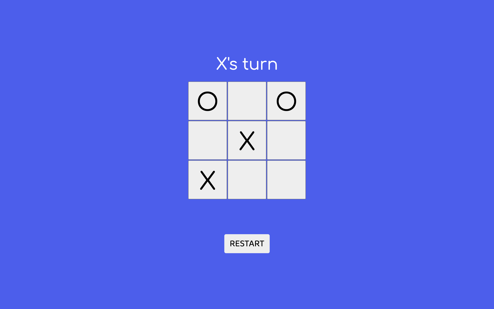

# Tic Tac Toe

A two-player Tic Tac Toe game built with vanilla JavaScript using Factory Functions.

🔗 [Live Demo](https://apociello.github.io/TicTacToe/)

## Screenshot

## Features

- Two-player gameplay
- Turn indicator
- Win detection
- Draw detection
- Restart button

## Built with

- HTML
- CSS
- JavaScript